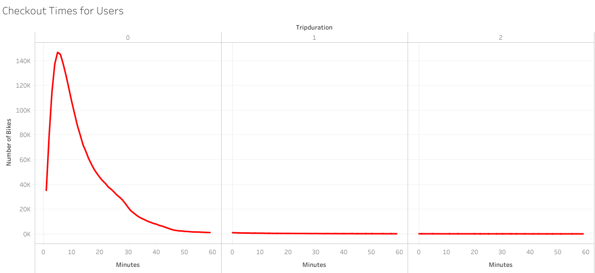
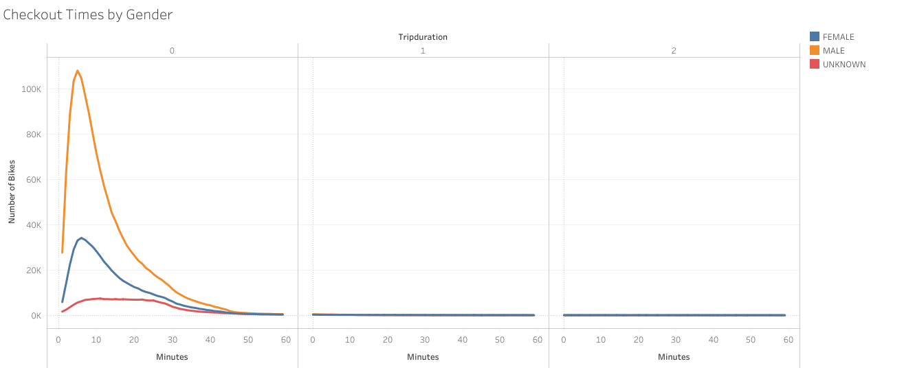
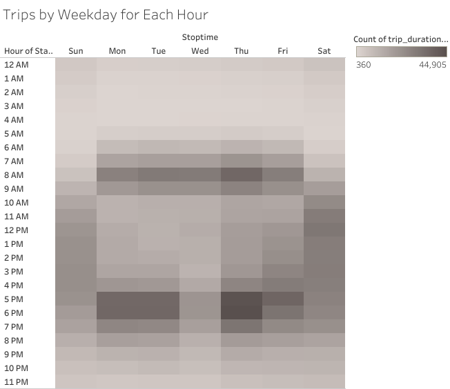

# Bikesharing

## Purpose
The mission of this analysis was to persuade investors to implement a much-needed bike sharing program in the city of Des Moines. In order to propose this great business plan, I had to convert the “tripduration” column within the Citi Bike file from an integer to a datetime datatype. From there the file was then used to create visuals in Tableau.

## Results

In August there were 2,344,224 bikes used. A majority of those bikes were used for less than 6 minutes.

Of those 2,344,224 bikes used, males were 3 times as likely than women to use the bikes for less than 6 minutes.

In the graph above, we can conceptualize the amount of bike users by day and time. Most users range from Monday-Friday between the hours of 7am-9am and 4pm-7pm. On the weekends, we can see that Saturday has more users than Sunday. However, the day and time with the most users is Thursday at 6pm.