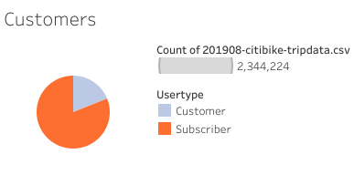

# Bikesharing

## Objective 
The objective of this analysis was to convince investors to launch a bike-sharing program in Des Moines. To present this compelling business proposal, I first converted the "tripduration" column in the Citi Bike dataset from an integer to a datetime data type. Then, I used the dataset to generate visualizations in Tableau.

## Results

* In August there were 2,344,224 bikes used. A majority of those bikes were used for less than 20 minutes.

## 

* Of those 2,344,224 bikes used, males were 3 times as likely than women to use the bikes for less than 20 minutes. 

## 

* In the graph above, we can conceptualize the amount of bike users by day and time. Most users range from Monday-Friday between the hours of 7am-9am and 4pm-7pm. On the weekends, we can see that Saturday has more users than Sunday. However, the day and time with the most users is Thursday at 6pm.

## 

.png)

* In the image above, 6pm on Thursday seems to be the time slot with the most male and female users. As for the unknown gender, 12pm on Saturday appears to have the maximum amount of users. But for both male and female, we can see there that users are more likely to use the bikes for work commutes.

## 

* Here we can see that most birth years have an average trip duration of 800 minutes and those with a later birth year are more likely to have a longer ride.

## 

* Most male and female users during the weekday are subscribers. While those with an unknown gender are mainly customers.

## 

* Out of the total users in August, 1,900,359 are subscribers and 443,865 are customers.

## Summary
The pie chart revealed that the number of subscribers exceeds the number of customers, indicating a preference for a fixed subscription fee, which allows users to access the bikes whenever they need them. This also suggests that many users are residents rather than tourists.

The majority of users are male, suggesting that they are a key target demographic for future expansion.

As there are more starting points in the Downtown area, it is necessary to ensure that there are enough bikes available in that location to meet the demand.

Demand for bikes is higher during weekdays from 7-9 am and 4-7 pm, due to the work schedule of most people. On weekends, demand is more consistent throughout the day as people have more free time to explore the city.

It's important to note that Des Moines has a population of 212,031 compared to New York City's population of 8.468 million, requiring data adjustment to create effective business strategies.

For future analysis, I recommend creating visualizations that display user demographics by birth year to determine the age ranges of users and develop targeted marketing campaigns. Additionally, a heatmap showing the start time of trips could be helpful for scheduling bike maintenance to avoid peak hours.

[link to dashboard](https://public.tableau.com/app/profile/zenat1847)
